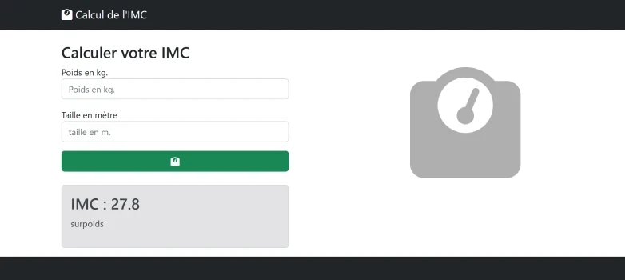

# TP 01 - Calcul de l'IMC

<a href="https://sevenvalley.fr/tp-javascript/tp1/index.html">TP 1 Live preview - Tester l'application</a>

A partir du fichier <code>imc-maquette.html</code>
  
:one:  Saisir le **poids** en kg  
:two: Saisir la **taille** en m  
:three: Récupérer les variables lors du clique sur bouton  
- utiliser <code>parseFloat()</code> pour transformer la chaîne de caractère en Float  
   
:four: Calculer la variable **imc**
  
   **imc** = poids / (taille*taille)
     
   exemple :  **80kg** / (1.8m x 1.8m) = **24,7**
  
:five: Afficher l'IMC 
- utiliser <code>toFixed(1)</code> pour arrondir l'IMC à 1 chiffre après la virgule [doc toFixed(1)](https://www.w3schools.com/jsref/jsref_tofixed.asp)
       
:six: Trouver la tranche    
- Si **imc** &lt; 18.5 je suis en tranche **maigreur**   
- Si 18.5 &lt;**imc** &lt; 25  je suis en tranche **normal**  
- Si 25 &lt;**imc** &lt; 30  je suis en tranche **surpoids**  
- Si 30 &lt;**imc** &lt; 35  je suis en tranche **obésité**  
- Si 35 &lt;**imc** &lt; 40  je suis en tranche **obésité massive**    
- Si **imc** &gt; 40  je suis en tranche **obésité morbide**  

:seven: Afficher la tranche    
:eight: Calculer le poids à atteindre  
- si surpoids   
  **poidIdeal** = **25** x taille x taille    
- si maigreur    
  **poidIdeal** = **18.5** x taille x taille
     
:nine: Calculer les kilogrammes à perdre ou prendre  
**10** - Afficher Ces 2 objectif

[Calcul de l'IMC avec wikipedia](https://fr.wikipedia.org/wiki/Indice_de_masse_corporelle)