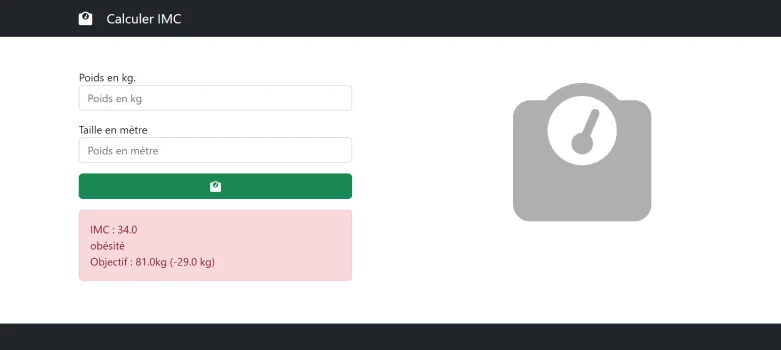

# TP  01 IMC
## TP 1

## TP 2 - avec couleurs

  
## Demo live  
<a href="https://sevenvalley.fr/tp-javascript/tp1/index.html">TP 1 Live preview</a>
  
<a href="https://sevenvalley.fr/tp-javascript/tp2/index.html">TP 2 Live preview</a>

- Saisir le poids en kg
- Saisir la taille en m
  
imc = poids / (taille*taille)
  
80kg / (1.8m* 1.8m) = 25
  
Si imc < 18.5 je suis en tranche maigreur      
Si 18.5 <imc < 25  je suis en tranche normal  
Si 25 <imc < 30  je suis en tranche surpoids  
Si 30 <imc < 35  je suis en tranche obésité  
Si 35 <imc < 40  je suis en tranche obésité massive    
Si  > 40  je suis en tranche obésité sévère 
  
**TP2 :** changer les couleur className en fonction de l'imc
  
Afficher le poids à atteindre

si surpoids  
poidIdeal = 25 * taille * taille  

si maigreur  
poidIdeal = 18.5 * taille * taille  

Afficher le nombre de kg à perdre
  
https://fr.wikipedia.org/wiki/Indice_de_masse_corporelle
