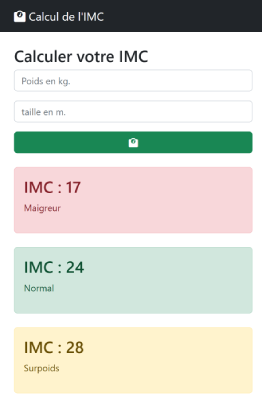

# TP 02 - IMC avec couleurs

<a href="https://sevenvalley.fr/tp-javascript/tp2/index.html">TP 2 Live preview - Tester l'application</a>

A partir du fichier <code>imc-maquette-2.html</code>
  
- Afficher une couleur différente en fonction du résultat  
:one:  Si **imc** &lt; 18.5 je suis en tranche **maigreur** : 
$\color{red}{\text{danger}}$    rouge  
:two:  Si 18.5 &lt;**imc** &lt; 25  je suis en tranche **normal**   : $\color{green}{\text{normal}}$ vert  
:three:  Si 25 &lt;**imc** &lt; 30  je suis en tranche **surpoids** : $\color{yellow}{\text{warning}}$[warning] jaune    
:four:  Si 30 &lt;**imc** &lt; 35  je suis en tranche **obésité** : $\color{red}{\text{danger}}$ rouge   
:five:  Si 35 &lt;**imc** &lt; 40  je suis en tranche **obésité massive**  : $\color{black}{\text{secondary}}$ noir     
:six:  Si  **imc** &gt; 40  je suis en tranche **obésité morbide**  $\color{blue}{\text{primary}}$  bleu    