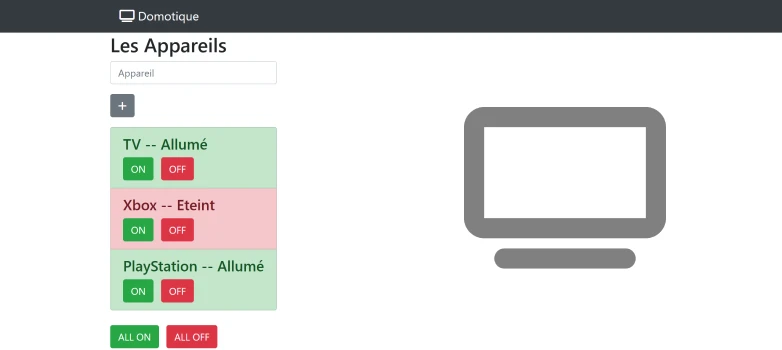

# TP 04 domotique

[Tester le TP Alpha](https://www.sevenvalley.fr/tp-javascript/tpd) 



- Créer un tableau d'objets appareils
- Créer le component Appareil
- Envoyer les élèments du tableau au component Appareil
- Changer la couleur du background
- Allumer et Eteindre un appareil
- Allumer et Eteindre tous les appareils
  


```js
const appareils =[
  {name:'PlayStation 5', status:true},
  {name:'Machine à café', status:false},
  {name:'Xbox', status:false}
]
```